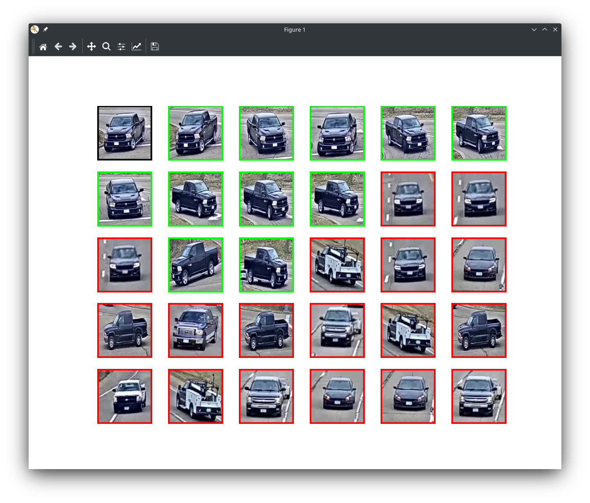

<h1 align="center"> Object/Vehicle Re-identification </h1>

[](https://opensource.org/licenses/MIT)

Baseline code for object re-identification. Based on [layumi's person re-id
repo](https://github.com/layumi/Person_reID_baseline_pytorch).
The code is general (although tested on vehicles), and works for any re-id task or dataset if the
required annotation files are created.

**A vehicle re-id tutorial is available in a
[Kaggle notebook](https://www.kaggle.com/code/sosperec/vehicle-reid-tutorial/)
for training, evaluating, and using a model.**

## Installation
Tested on python3.7 to 3.10, but probably other versions work too.
Clone the repo, then create a virtual environment:
```
$ python3 -m venv .venv
$ source .venv/bin/activate
```
And install the requirements (mostly torch and other utility packages ~2.0GB
in total):
```
$ pip3 install -r requirements.txt
```

A complete install is not always necessary with the exact versions in the
`requirements.txt`, the following versions also seem to work:
```
torch>=1.7.0
pytorch_metric_learning>=1.2.0
numpy>=1.13.0
pandas>=1.2.2
torchvision>=0.8.0
timm>=0.6.7
pretrainedmodels>=0.7.4
```

## Data preparation

For training a re-id model the dataset has to be prepared. The images can be stored in any structure, but a csv file is needed for the train and validation subsets. The csv files contain a row per image and have mandatory `path` and `id` columns (and possible other columns, that are ignored).
```
$ head train_annot.csv 
path,id
cityflow2_reid/image_train/006561.jpg,54642
cityflow2_reid/image_train/048961.jpg,54520
cityflow2_reid/image_train/017624.jpg,54669
```
The paths are relative to the **dataset root folder**, which is passed to the
scripts. An example directory structure could look like this:
```
|── datasets/
|    |── annot/
|        |── train_annot.csv
|        |── val_annot.csv
|    |── VeRi-Wild/
|        |── images/ 
│    ├── cityflow2_reid/
|    |── VehicleX/ 
```

## Train

The `train.py` script can be used to train a model, and saves it into a subdirectory under `model`. The most important (mandatory) parameters:
- `--name`: Name of the model under the `model` subdirectory, it shouldn't exist yet, or things can be overwritten.
- `--data_dir`: The root directory of the datasets. 
- `--train_csv_path`: The csv containing training data.
- `--val_csv_path`: The csv containing validation data.

Other very important parameters:
- `--batchsize`: Batch size during training, should be reasonable (like 32, 64).
- `--model`: By default a Resnet50-ibn is trained. All options are: ['resnet', 'resnet_ibn', densenet', 'swin',
                    'hr', 'efficientnet']
- `--model_subtype`: Type of model (e.g "50" or "101" for resnet, and "b0"-"b7" for efficientnet).
- `--total_epoch`: Number of epochs - around 15 to 20 is needed at a minimum depending on the size of the dataset (with ~400 000 images I got decent results even after 10)
- `--warm_epoch`: Number of warmup epochs (increase learning rate gradually)
- `--save_freq`: Sets the frequency of saving a model in epochs (1: saving after each one, 2: after every second, etc), but the model is saved at the very end regardless.
- `--lr`: Base learning rate.
- `--fp16`: Use Mixed precision training (convert to float16 automatically in
  forward pass)
- `--triplet`, `--contrast`, `--sphere`, `--circle`: Loss functions.

The following command is an example to train a Resnet50-ibn with contrastive loss:

```bash
python3 train.py \
    --data_dir=datasets/ \
    --name=resnet_debug  \
    --train_csv_path=datasets/annot/id_split_train.csv \
    --val_csv_path=datasets/annot/id_split_val.csv \
    --save_freq=1 \
    --fp16 \
    --contrast \
    --total_epoch=20
```

If we cannot complete the whole training in one session, it can be continued from a checkpoint by providing the following parameters:
- `--name`: it's value is the same as in the previous run
- `--checkpoint`: A model weight to be loaded, it is under the model's directory with the name of`net_X.pth`. (X = the number of epochs)
- `--start_epoch`: Epoch to continue from, if the checkpoint was `net_X.pth` this should be `X+1`.


## Test and evaluate

The `test.py` script computes embeddings for all gallery and query images and
evaluates various metrics. It can be run with the following parameters:
- `--data_dir`: Root dataset directory.
- `--query_csv_path`: Query annotation csv file.
- `--gallery_csv_path`: Gallery annot csv file.
- `--model_opts`: Path to the options used when training the model (e.g `~/vehicle_reid/model/resnet_debug/opts.yaml`)
- `--checkpoint`: Path to the checkpoint. The last one is always saved, but if we overtrained we can choose a previous one.
- `--batchsize`: Batch size for the model (does only affect performance, in
  case of low memory, this should be decreased).


Use trained model to extract features and evaluate metrics by:

```bash
python3 test.py \
    --data_dir=datasets/ \
    --query_csv_path=datasets/annot/id_split_cityflow_query.csv \
    --gallery_csv_path=datasets/annot/id_split_cityflow_gallery.csv \
    --model_opts=model/resnet_debug/opts.yaml \
    --checkpoint=model/resnet_debug/net_14.pth \
    --batchsize=8
```
It will output Rank@1, Rank@5, Rank@10 and mAP results.

## Visualization

A simple script `visualize_test_queries.py` allows us to inspect and save some
queries. It can be run with the same parameters as `test.py`, but if we
already ran `test.py` on the current dataset, it saved the result as
`pytorch_result.mat`. The `--use_saved_mat` switch makes the visualization
script use this cached result instead of loading and executing the model:

```bash
python3 visualize_test_queries.py \
    --data_dir=datasets/ \
    --query_csv_path=datasets/annot/id_split_cityflow_query.csv \
    --gallery_csv_path=datasets/annot/id_split_cityflow_gallery.csv \
    --model_opts=model/resnet_debug/opts.yaml \
    --checkpoint=model/resnet_debug/net_14.pth \
    --use_saved_mat
```

A screenshot of the utility is below. The query image is the first with a
<span style="color:black">black</span> border, then come the gallery images
ordered descending by similarity to the query (so only the most similar images
are shown). The gallery images have a <span style="color:green">green</span> or <span
style="color:red">red</span> border depending on whether they are the same or
a different id than the query.
**The left and right arrows on the keyboard helps to navigate the queries.**



## Datasets

| name | images | identities |
| :--- | :---: | :---: |
| VRIC | 60K | 5622 |
| Cityflow (v2) | 313K | 880 |
| VeRi-776 | 50K | 776 |
| VeRi-Wild | 416K | 40K |
| VehicleID | 221K | 26K |
| PKU-VD1 | 846K | 141K |
| PKU-VD2 | 807K | 79K |
| VehicleX | ∞ | ∞ (~170 models) |

## Results

### VRIC

Models are trained on a random 75% of VRIC train, and tested on VRIC test.
All trainings used cross entropy as **id loss**, this is not listed in losses.
The default param values used (these are only mentioned in the table if they
differ from this):  
`--batchsize=32`, `--total_epoch=20`, `--warm_epoch=3`, `--erasing_p=0.5`,
`--samples_per_class=4`, `--lr=0.05`


| model                         | metric losses            | other params                              | Rank@1   | Rank@5   | Rank@10  | mAP      |
|:-----------------------------:|:------------------------:|:-----------------------------------------:|:--------:|:--------:|:--------:|:--------:|
|  Resnet50-ibn | `--circle`, `--contrast` |                                           | **73.1** | **91.0** | **94.8** | **77.1** |
| Resnet50-ibn                  | `--contrast`             |                                           | 72.3     | 89.6     | 93.0     | 76.2     |
| Resnet50-ibn                  | `--circle`               |                                           | 72.1     | 90.7     | 94.3     | 76.2     |
| Resnet50-ibn                  | `--triplet`              |                                           | 71.9     | 89.2     | 93.0     | 75.9     |
| Resnet50-ibn                  | `--cosface`              |                                           | 69.1     | 86.7     | 90.7     | 73.1     |
| Resnet50-ibn                  | `--instance`             |                                           | 68.6     | 86.8     | 90.8     | 72.7     |
| Resnet50-ibn                  | `--arcface`              |                                           | 68.3     | 87.3     | 91.0     | 72.5     |
| Resnet50-ibn                  | `--sphere`               |                                           | 68.0     | 86.6     | 90.5     | 72.1     |
| Resnet50-ibn                  |                          |                                           | 68.4     | 86.8     | 90.4     | 72.5     |
| Resnet50-ibn                  |                          | `--samples_per_class=1`                   | 67.3     | 86.7     | 91.2     | 71.7     |
| Resnet50-ibn                  |                          | `--batchsize=64`                          | 64.5     | 84.5     | 89.9     | 69.1     |
| Resnet50-ibn                  |                          | `--batchsize=64`, `--samples_per_class=6` | 64.6     | 83.9     | 88.3     | 69.0     |
| Resnet50-ibn                  |                          | `--label_smoothing=0.05`                  | 68.5     | 86.4     | 90.3     | 72.5     |
| Resnet50-ibn                  |                          | `--fp16`                                  | 68.6     | 86.5     | 90.7     | 72.6     |
| Resnet50                      |                          |                                           | 64.6     | 84.8     | 89.6     | 69.2     |
| Efficientnet-b0               |                          |                                           | 63.7     | 83.3     | 88.1     | 68.2     |
| HRNet                         |                          |                                           | 70.4     | 87.8     | 91.3     | 74.2     |
| DenseNet121                   |                          |                                           | 65.8     | 85.6     | 90.4     | 70.2     |


## Citation
The following paper uses and reports the result of the original baseline model
(for person re-id). You may cite it in your paper.
```bib
@article{zheng2019joint,
  title={Joint discriminative and generative learning for person re-identification},
  author={Zheng, Zhedong and Yang, Xiaodong and Yu, Zhiding and Zheng, Liang and Yang, Yi and Kautz, Jan},
  journal={IEEE Conference on Computer Vision and Pattern Recognition (CVPR)},
  year={2019}
}
```
